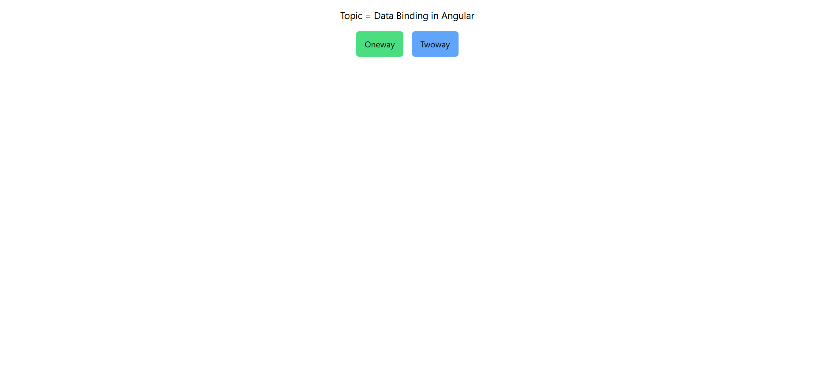
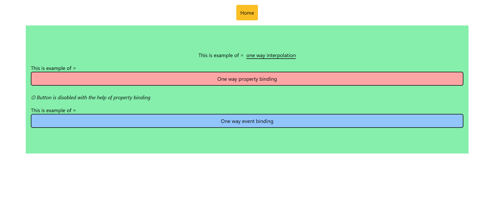
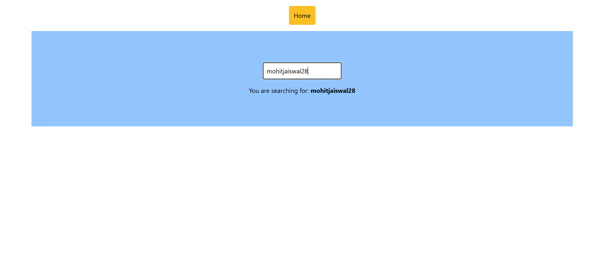

# Data Binding in Angular

`Data binding in Angular allows you to synchronize the data between the component class and the template using interpolation, property binding, event binding, and two-way binding`

There are basically two types of data binding in Angular:

- One-way Data Binding ➡️
- Two-way Data Binding 🔄

## One-way Data Binding ➡️

One-way data binding in Angular allows you to bind data from the component to the view or view to component. Depending on the direction, one-way data binding is further categorized into two types:

- Component to View ➡️
- View to Component ⬅️

### 1. Component to View ➡️

- **Interpolation** `{{}}`
- **Property Binding** `[]`

### 2. View to Component ⬅️

- **Event Binding** `()`

## Two-way Data Binding 🔄

Two-way data binding in Angular allows you to bind data from the component to the view and vice versa. This means that changes in the component will reflect in the view, and changes in the view will also update the component.

To implement two-way data binding, you can use the `ngModel` directive.

### `ngModel` 📝

The `ngModel` directive is used to create a two-way data binding between a form control element and a component property. It allows you to bind the value of an input element to a component property, and also update the component property when the value of the input element changes.

To use `ngModel`, you need to import the `FormsModule` from `@angular/forms` in your Angular module.

Two-way data binding is useful when you want to synchronize data between the component and the view, allowing for real-time updates in both directions.

- Box - `[]`
- Banana - `()`
- Banana in the box = `[()]`

## Demo ⭐

